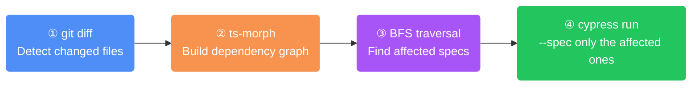
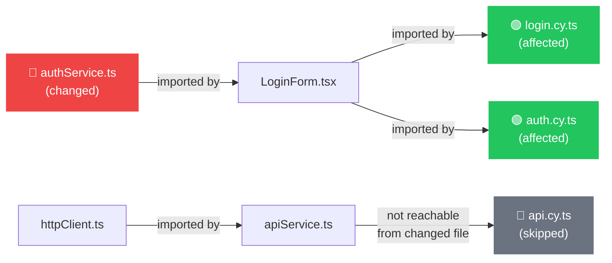

<p align="center">
  <h1 align="center">masat-cypress</h1>
  <p align="center">Run only the Cypress specs <strong>provably affected</strong> by your git changes — using a real TypeScript dependency graph, not filename guessing.</p>
</p>

<p align="center">
  <a href="https://www.npmjs.com/package/masat-cypress"></a>
  <a href="https://github.com/tugberkmasat/masat-cypress/actions/workflows/ci.yml"></a>
  <a href="https://nodejs.org"></a>
  
</p>

---

## The Problem

Naive approaches match changed file names against spec file names — and break constantly:

| Changed file | Filename match | Graph-based (masat-cypress) |
|---|---|---|
| `src/services/authService.ts` | Looks for `auth` in spec names | Traverses: `authService → LoginForm → login.cy.ts` ✓ |
| `src/utils/httpClient.ts` | Looks for `http` or `client` | Finds every spec that uses any service using the client ✓ |
| `src/shared/Button.tsx` | May match dozens of unrelated specs | Matches only specs that import components using Button ✓ |

**masat-cypress** uses the TypeScript compiler API (ts-morph) to build an accurate import graph, then walks it with BFS to find every spec that is transitively affected.

---

## How It Works

### The 4-step pipeline



### Dependency graph traversal

When `authService.ts` changes, the reverse graph is walked via BFS to find all affected specs:



### Graph data structure

```
Forward graph (dependencies):
  login.cy.ts  ──►  LoginForm.tsx  ──►  authService.ts

Reverse graph (dependents) — what BFS traverses:
  authService.ts  ──►  LoginForm.tsx  ──►  login.cy.ts  ← spec found ✓
```

Both directions are stored simultaneously as the graph is built, so BFS is O(nodes + edges) with no extra cost.

---

## Installation

```bash
# Inside a project (recommended)
npm install --save-dev masat-cypress
```

Add to your scripts:

```json
{
  "scripts": {
    "test:affected": "masat-cypress run --smart"
  }
}
```

```bash
# Or globally
npm install -g masat-cypress
```

---

## Quick Start

```bash
# Run only specs affected by changes since origin/main
masat-cypress run --smart

# Preview which specs would run, without launching Cypress
masat-cypress run --smart --dry-run

# Open Cypress for affected specs only
masat-cypress open --smart
```

---

## All Options

```bash
masat-cypress run [--smart] [options] [-- <cypress args>]
```

| Option | Default | Description |
|---|---|---|
| `--smart` | — | Enable smart mode (dependency graph analysis) |
| `--base <ref>` | `origin/main` | Git ref to diff against |
| `--tsconfig <path>` | `tsconfig.json` | Path to tsconfig.json |
| `--spec-globs <globs>` | `cypress/e2e/**/*.cy.ts,...` | Comma-separated globs for spec discovery |
| `--spec-pattern <patterns>` | — | Additional spec suffixes (e.g. `.e2e.ts,.test.ts`) |
| `--run-all-on-no-match` | `false` | Fall back to the full suite when nothing matches |
| `--dry-run` | `false` | Print affected specs without launching Cypress |
| `--no-cache` | `false` | Rebuild graph from source, skip cache |
| `--verbose` | `false` | Show per-step timings, graph stats, dead-end analysis |

Any unknown flags are forwarded directly to Cypress:

```bash
# Pass --headed and --browser directly to Cypress
masat-cypress run --smart -- --headed --browser chrome
```

---

## Config File

Instead of passing flags every time, create `masat-cypress.config.json` in your project root:

```json
{
  "base": "origin/develop",
  "tsconfig": "tsconfig.app.json",
  "specGlobs": "cypress/e2e/**/*.cy.ts",
  "runAllOnNoMatch": true,
  "verbose": true
}
```

Or add a `"masat-cypress"` key to `package.json`:

```json
{
  "masat-cypress": {
    "base": "origin/develop",
    "runAllOnNoMatch": true
  }
}
```

**Priority:** CLI flags › config file › defaults.

---

## CLI Output

```
────────────────────────────────────────────────────────
  masat-cypress run --smart
────────────────────────────────────────────────────────
  Base ref      : origin/main
  tsconfig      : tsconfig.json
────────────────────────────────────────────────────────

[1/4] Detecting changed files…
      Found 2 changed file(s):
        • src/services/authService.ts
        • src/components/LoginForm.tsx

[2/4] Building dependency graph…
      Parsing project with ts-morph…
      Graph built. 148 node(s), 312 edge(s).

[3/4] Detecting affected tests…
      Affected specs (2):
        • cypress/e2e/login.cy.ts
        • cypress/e2e/auth.cy.ts

[4/4] Running cypress run…

────────────────────────────────────────────────────────
  ✓  All affected tests passed.
────────────────────────────────────────────────────────
```

With `--verbose`, each step also shows its duration and dead-end file analysis:

```
      [debug] Step 1 completed in 12ms
      [debug] Step 2 completed in 840ms
      [debug] Dead-end files (no dependents, 4 total – changes won't trigger any spec):
              • src/scripts/seed.ts
              • src/scripts/migrate.ts
      [debug] Step 3 completed in 3ms
      [debug] Total elapsed: 1421ms
```

---

## Use in CI

```yaml
# .github/workflows/test.yml
- name: Run affected Cypress specs
  run: npx masat-cypress run --smart --run-all-on-no-match
```

Or use `--dry-run` as a pre-check step:

```yaml
- name: Preview affected specs
  run: npx masat-cypress run --smart --dry-run
```

---

## How the cache works

```
First run:   ts-morph parses all source files  →  graph saved to .masat-cypress/cache/graph.json
Next runs:   mtime check on tsconfig + spec globs  →  graph loaded from cache in <10ms
--no-cache:  always rebuilds from source
```

The cache is project-local and safe to gitignore:

```gitignore
.masat-cypress/
```

---

## License

MIT
